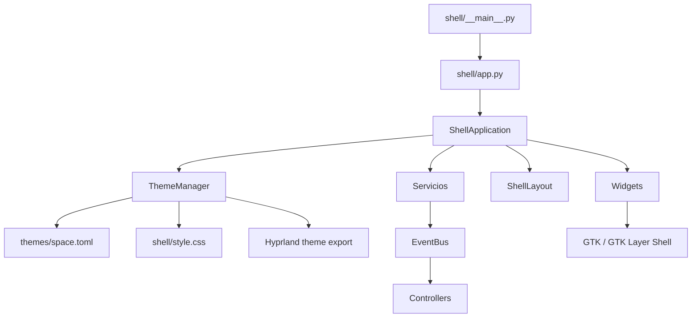

# Arquitectura

## Diagrama de arranque

## Capas

### Entrada y composición

- [`shell/__main__.py`](../../shell/__main__.py) llama a `main`.
- [`shell/app.py`](../../shell/app.py) crea servicios, widgets, controllers, CSS y la ventana principal. `--install` registra la identidad XDG sin arrancar la barra.
- [`shell/identity.py`](../../shell/identity.py) define `com.jugoo.Shell` y los títulos de superficie.
- [`shell/layout.py`](../../shell/layout.py) define las zonas izquierda, centro y derecha de la barra.

### Servicios

Los servicios leen Linux, D-Bus, PipeWire o Hyprland. No deberían construir widgets. Ejemplos: `SystemStatsService`, `AudioService`, `NetworkService` y `HyprlandService`.

### Widgets

Los widgets convierten snapshots y eventos en GTK. Están agrupados por zona o función en [`shell/widgets/`](../../shell/widgets/).

### Controllers

Los controllers conectan eventos con acciones o popups. La lógica de interacción suele estar en [`shell/controllers/`](../../shell/controllers/), no en el servicio que obtiene el dato.

### Estado y eventos

[`shell/eventbus.py`](../../shell/eventbus.py) distribuye eventos internos. Las constantes de eventos suelen vivir junto al servicio que los produce.

### Tema

[`shell/ui/theme.py`](../../shell/ui/theme.py) valida el TOML activo, compila
los roles semánticos junto con la hoja estructural y conserva el
`Gtk.CssProvider` global. El evento `theme_changed` actualiza componentes
programáticos como el espectro. Un cambio inválido se rechaza sin sustituir el
último tema válido.

GTK3 recibe color, opacidad y radios. El blur se exporta a Hyprland, porque GTK3
no puede desenfocar por sí mismo el fondo del compositor.

## Ciclo de un dato

1. Un servicio descubre una fuente del sistema.
2. El servicio devuelve un dataclass o snapshot.
3. Un widget lee el snapshot en un timer o recibe un evento.
4. El widget actualiza labels, clases CSS, iconos o ventanas.
5. El CSS compilado desde el tema aplica color, espaciado, tamaño y estado visual.

## Punto de entrada real de la barra propia

`ShellApplication.__init__()` monta `StatsWidget(self.system_stats)` en `self.layout.right`; el monitor Radeon se configura desde el shell GTK.
